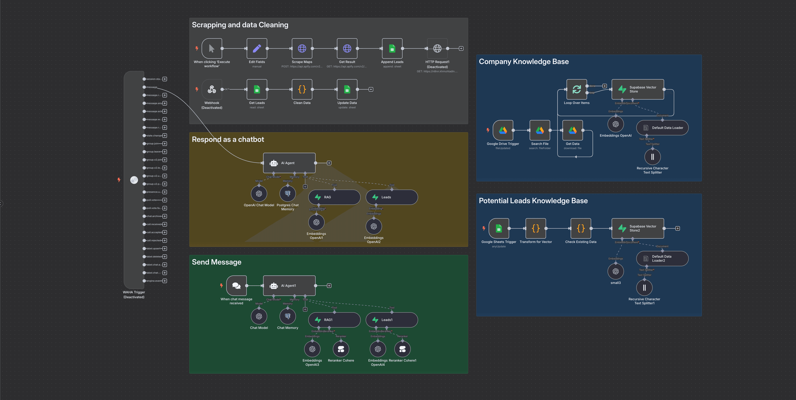
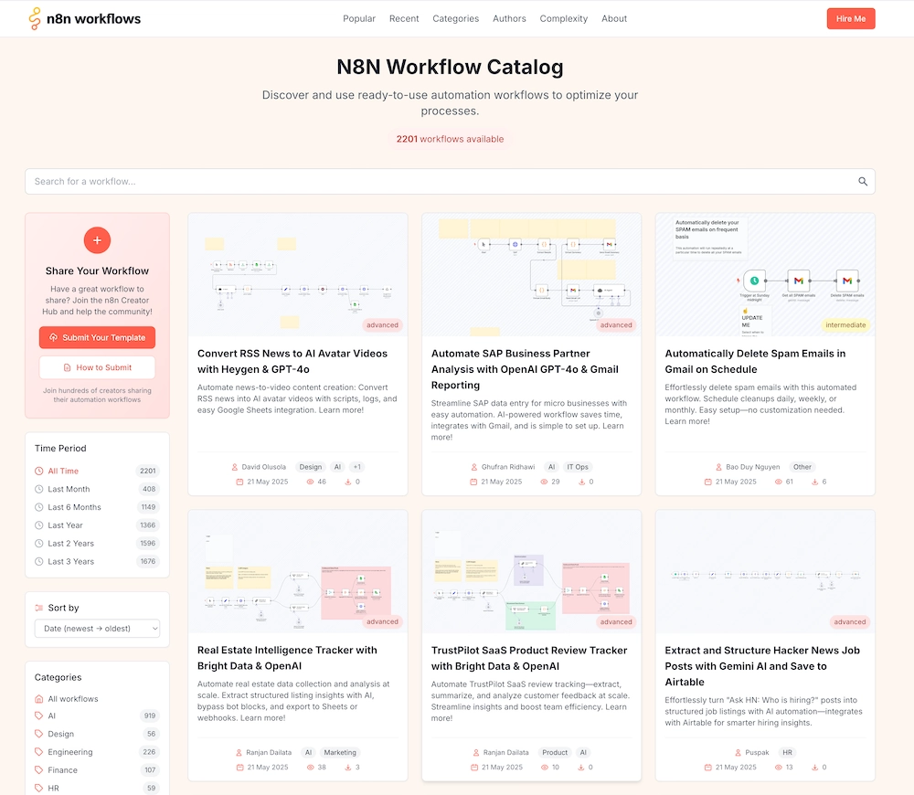

# Telegram Support Bot with OpenAI, Pinecone and Human Expert Escalation

Advanced n8n automation for Telegram Support Bot with OpenAI, Pinecone and Human Expert Escalation.

## Overview
- Category: Support Chatbot, AI RAG
- Complexity: advanced
- Source: n8n workflow template export

## What This Automation Does
Boost your Telegram group support with a smart AI assistant: auto-answer FAQs, forward complex queries to experts, and improve responses over time.

## Included Files
- `workflow.json`

## Setup
1. Import `workflow.json` into n8n.
2. Configure required credentials for the services used in the workflow nodes.
3. Update any environment variables or static values inside nodes (API keys, URLs, IDs).
4. Run a test execution and then activate the workflow.

## Tech Stack

- `@n8n/n8n-nodes-langchain.documentDefaultDataLoader`
- `@n8n/n8n-nodes-langchain.embeddingsOpenAi`
- `@n8n/n8n-nodes-langchain.textSplitterRecursiveCharacterTextSplitter`
- `@n8n/n8n-nodes-langchain.vectorStorePinecone`
- `n8n-nodes-base.code`
- `n8n-nodes-base.if`
- `n8n-nodes-base.set`
- `n8n-nodes-base.stickyNote`
- `n8n-nodes-base.switch`
- `n8n-nodes-base.telegram`
- `n8n-nodes-base.telegramTrigger`

## Author

Murtaza Baig

## Screenshots

## License
MIT License. See `LICENSE`.